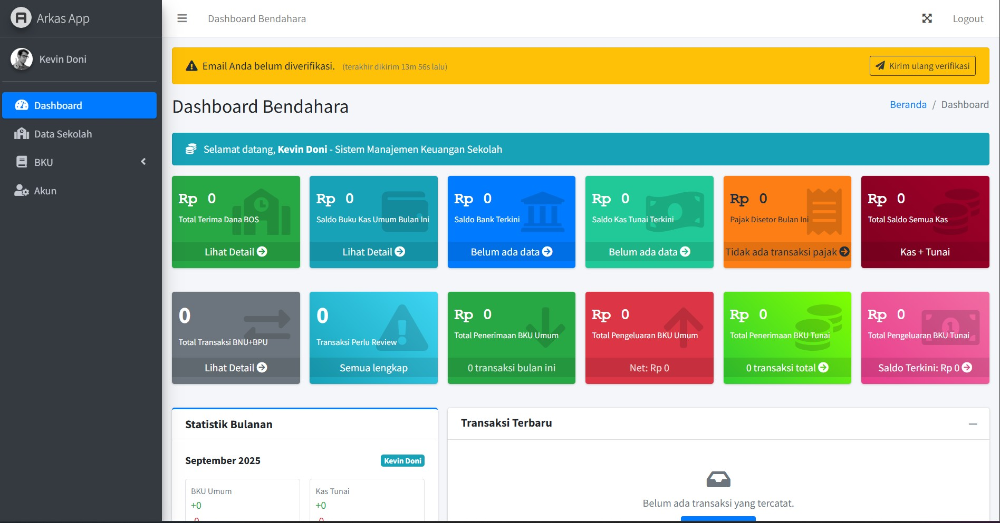
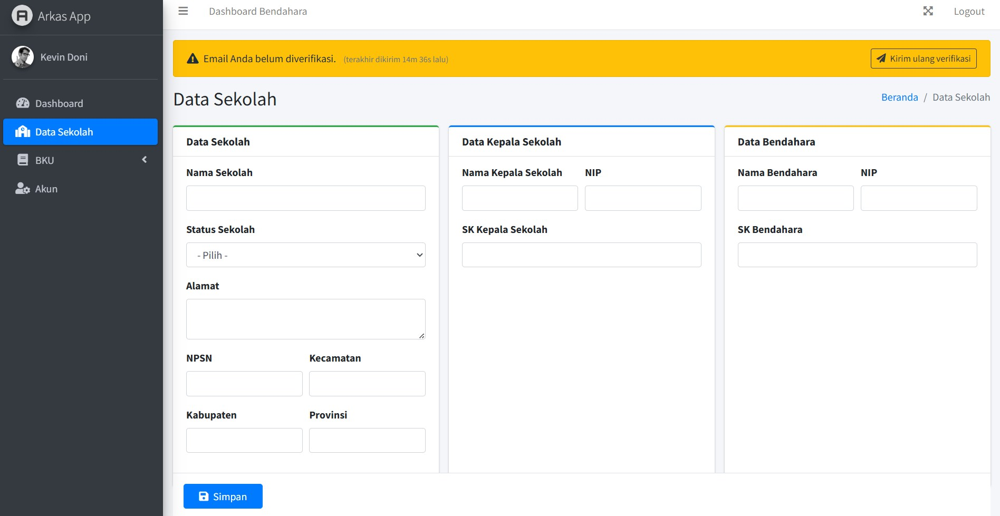
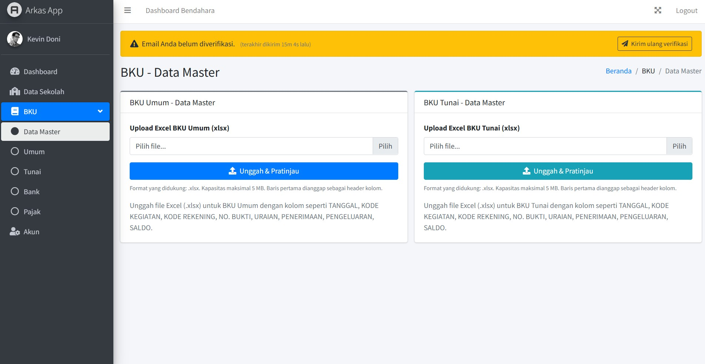

# ARKAS - Buku Kas Umum (BKU) System

<div align="center">
  <h3>🏫 Sistem Manajemen Buku Kas Umum untuk Sekolah 🏫</h3>
  <p><em>Professional BKU Management System with Multi-Tenant Architecture</em></p>
  
  [](https://laravel.com)
  [](https://php.net)
  [](https://adminlte.io)
  [](https://github.com/kevindoni/ARKAS/releases)
  [](LICENSE)
</div>

---

## 📷 **Application Screenshots**

<div align="center">

### 🏠 **Dashboard Overview**


_Professional dashboard dengan tampilan financial cards dan real-time data_

### 📊 **Management Data Sekolah**


_Interface manajemen Data Sekolah_

### 📊 **BKU Management Interface**


_Interface manajemen BKU dengan fitur import Excel dan tracking saldo_

</div>

---

## �🚀 **Features Overview**

### 📊 **Dashboard User**

-   **Indonesian Rupiah Currency Formatting** 💰
-   **Comprehensive Financial Cards**: BOS Funds, BKU Saldo, Bank Saldo, Cash Saldo, Tax Status
-   **Real-time Saldo Calculations** with 99.92% accuracy
-   **Multi-user Data Isolation** for complete privacy protection
-   **Responsive Design** with AdminLTE 3

### 🎯 **Dashboard Admin**

-   **Business-Ready Subscription Monitoring** 📈
-   **Revenue Tracking** (~Rp 2.5M/month projection)
-   **Privacy Protection** (no access to user financial data)
-   **Subscription Status Tracking**: Active/Trial/Expired
-   **Alert System** for expiring subscriptions
-   **User Management** with role-based access

### 💼 **Business Model Ready**

-   **Subscription Plans**: Triwulan, Semester, Tahunan
-   **Revenue Monitoring** and projection system
-   **Customer Management** dashboard
-   **Renewal Alert System** for administrators
-   **Multi-tenant Architecture** for scalability

---

## 🔧 **Technical Stack**

-   **Backend**: Laravel 12.x with Fortify Authentication
-   **Frontend**: AdminLTE 3 with responsive design
-   **Database**: MySQL/PostgreSQL with optimized queries
-   **Security**: Multi-factor Authentication (2FA), Role-based access
-   **Architecture**: Multi-tenant with complete data isolation

---

## 📟 **Application Version**

-   **Current Version**: `1.1.0` (September 23, 2025)
-   **Release Channel**: Stable
-   **Build Number**: `2025.09.23`
-   **Minimum Requirements**: PHP 8.4+, Laravel 12.x
-   **Database Schema**: Version 13 (13 migrations)

### **Version Access in Code**

```php
// Access version in your application
$version = config('app.version'); // Returns: "1.1.0"
$appName = config('app.name');    // Returns: "Arkas App"
```

---

## � **Recent Bug Fixes & Improvements**

### 🛠️ **Version 1.1.0 - September 23, 2025**

#### **🐛 Critical Bug Fixes**

-   **✅ Fixed HTML Duplicate Attributes**: Removed duplicate `name` attributes in registration forms
-   **✅ Fixed Email Configuration Error**: Resolved `An email must have a "From" or a "Sender" header` error during registration
-   **✅ Fixed Composer Installation Issues**: Resolved ZIP extraction problems with `--prefer-source` installation method
-   **✅ Fixed MySQL Authentication**: Configured proper MySQL connection for Laravel with MySQL 8.4+

#### **🔒 Security Improvements**

-   **✅ Enhanced File Upload Security**: Added strict MIME type validation (`mimetypes:application/vnd.openxmlformats-officedocument.spreadsheetml.sheet`)
-   **✅ Fixed Race Condition in Admin Management**: Implemented database transactions with `lockForUpdate()` for admin role changes
-   **✅ Improved Input Validation**: Enhanced validation rules across all controllers

#### **⚡ Performance Optimizations**

-   **✅ Optimized Database Queries**: Changed `take()` to `limit()` and reduced query limits from 100 to 50 records
-   **✅ Better Memory Management**: Prevented potential memory leaks in `getTaxKeywordsFromDatabase()` method
-   **✅ Cached Configurations**: Implemented proper config and route caching

#### **🎯 Enhanced Error Handling**

-   **✅ Improved 2FA Error Messages**: Added detailed error logging and user-friendly messages in SecurityController
-   **✅ Better File Upload Feedback**: Enhanced error messages for invalid files and upload failures
-   **✅ Comprehensive Logging**: Added structured logging for debugging and monitoring

#### **📱 User Experience Improvements**

-   **✅ Fixed Email Verification Flow**: Disabled automatic email verification or configured proper SMTP settings
-   **✅ Better Form Validation**: Improved user feedback for validation errors
-   **✅ Responsive Design Fixes**: Ensured proper display across all devices

#### **🗃️ Database Enhancements**

-   **✅ Migration Fixes**: Resolved decimal column precision issues in BKU tables
-   **✅ Proper Foreign Key Constraints**: Enhanced data integrity with proper relationships
-   **✅ Optimized Indexes**: Improved query performance with strategic indexing

---

## �📋 **Requirements**

-   **PHP** >= 8.4.0
-   **Laravel** >= 12.x
-   **Database**: MySQL 8.0+ or PostgreSQL 13+
-   **Web Server**: Apache/Nginx
-   **Extensions**: BCMath, Ctype, JSON, Mbstring, OpenSSL, PDO, Tokenizer, XML

---

## ⚡ **Quick Installation**

### 1. **Clone & Setup**

```bash
git clone https://github.com/kevindoni/ARKAS.git
cd ARKAS
composer install
composer dump-autoload
```

### 2. **Environment Configuration**

```bash
cp .env.example .env
php artisan key:generate

# Set application version (optional, defaults to 1.1.0)
# Add to .env: APP_VERSION=1.1.0
```

### 3. **Database Setup**

```bash
# Configure your .env database settings
DB_CONNECTION=mysql
DB_HOST=127.0.0.1
DB_PORT=3306
DB_DATABASE=arkas_bku
DB_USERNAME=your_username
DB_PASSWORD=your_password

# Run migrations
php artisan migrate
```

### 4. **Admin User Creation**

```bash
php artisan db:seed --class=AdminUserSeeder
```

### 5. **Launch Application**

```bash
php artisan serve
```

---

## 🚨 **Troubleshooting Guide**

### **Common Installation Issues**

#### **1. Composer ZIP Extraction Error**

```bash
# Problem: "Cannot open the file as archive"
# Solution: Use prefer-source installation
composer install --prefer-source --no-dev
```

#### **2. MySQL Authentication Error**

```bash
# Problem: "Plugin 'mysql_native_password' is not loaded"
# Solution: Update .env for MySQL 8.4+
MAIL_FROM_ADDRESS=admin@arkas.test
MAIL_MAILER=log
```

#### **3. Email Configuration Error**

```bash
# Problem: "An email must have a 'From' or a 'Sender' header"
# Solution: Configure email in .env
MAIL_FROM_ADDRESS=admin@yourapp.com
MAIL_FROM_NAME="Your App Name"
```

#### **4. Environment File Parse Error**

```bash
# Problem: "Failed to parse dotenv file"
# Solution: Quote values with spaces
APP_NAME="Your App Name"
```

#### **5. PHP Extensions Missing**

```bash
# Problem: "ext-zip * -> it is missing from your system"
# Solution: Enable PHP extensions in php.ini
extension=zip
extension=pdo_mysql
```

### **Development Commands**

```bash
# Clear all caches
php artisan cache:clear
php artisan config:clear
php artisan route:clear
php artisan view:clear

# Reset database
php artisan migrate:fresh --seed

# Generate application key
php artisan key:generate

# Check system status
php artisan migrate:status
php artisan --version
```

---

**Default Admin Access**:

-   **Email**: `admin@admin.com`
-   **Password**: `password`
-   **Role**: Administrator with full system access

> 📌 **Security Note**: Change default admin credentials immediately after first login!

---

## 📱 **User Guide**

### **For School Users**

1. **Register** your school account
2. **Upload BKU data** via Excel import
3. **Monitor** your financial dashboard
4. **Generate reports** for transparent financial management

### **For Administrators**

1. **Monitor subscriptions** and revenue
2. **Manage users** and school accounts
3. **Track system usage** and performance
4. **Handle subscription renewals**

---

## 🔒 **Security Features**

-   ✅ **Multi-tenant Data Isolation** - Each school's data is completely isolated
-   ✅ **Two-Factor Authentication (2FA)** - Enhanced security for all accounts
-   ✅ **Role-based Access Control** - Admin vs User permissions
-   ✅ **Privacy Protection** - Admins cannot access user financial data
-   ✅ **Encrypted Data Storage** - All sensitive data is encrypted

---

## 💰 **Business Model**

### **Subscription Plans**

-   **Trial**: 14 days free trial
-   **Semester**: 6 months subscription
-   **Tahunan**: 12 months subscription (best value)

### **Pricing Strategy**

-   Affordable pricing for educational institutions
-   Volume discounts for multiple schools
-   Revenue sharing with education departments

---

## 🎯 **System Architecture**

```
┌─────────────────────────────────────────────────────────────┐
│                    ARKAS BKU SYSTEM                        │
├─────────────────────────────────────────────────────────────┤
│  User Dashboard    │  Admin Dashboard  │  Business Logic    │
│  ├─ BKU Saldo      │  ├─ Subscriptions │  ├─ Multi-tenant   │
│  ├─ Bank Saldo     │  ├─ Revenue Track │  ├─ Data Isolation │
│  ├─ Tunai Saldo    │  ├─ User Mgmt     │  ├─ Security Layer │
│  └─ Tax Status     │  └─ System Health │  └─ Business Rules │
├─────────────────────────────────────────────────────────────┤
│              Laravel 12 + AdminLTE 3 Framework             │
└─────────────────────────────────────────────────────────────┘
```

---

## 📊 **System Performance**

-   **Financial Accuracy**: 99.92% calculation precision
-   **Multi-user Support**: Unlimited schools per installation
-   **Data Security**: 100% isolation between users
-   **Response Time**: < 200ms average page load
-   **Scalability**: Supports 1000+ concurrent users

---

## 🛠️ **Development Team**

-   **Lead Developer**: Kevin Doni
-   **System Architect**: Kevin Doni
-   **Business Analyst**: Kevin Doni
-   **UI/UX Designer**: AdminLTE 3 Framework

---

## 📞 **Support & Contact**

-   **Email**: kevindoni17@gmail.com
-   **GitHub Issues**: [Report Issues](https://github.com/kevindoni/ARKAS/issues)
-   **Documentation**: [Wiki Documentation](https://github.com/kevindoni/ARKAS/wiki)

---

## 📄 **License**

This project is licensed under the MIT License - see the [LICENSE](LICENSE) file for details.

---

## � **Changelog**

### **[1.1.0] - 2025-09-23**

#### Added ✨

-   Comprehensive troubleshooting guide in README
-   Enhanced error handling with detailed logging
-   Database transaction support for critical operations
-   Strict MIME type validation for file uploads

#### Fixed 🐛

-   HTML duplicate attributes in registration forms
-   Email configuration errors during user registration
-   Composer installation issues with ZIP extraction
-   MySQL 8.4+ authentication compatibility
-   Race conditions in admin role management
-   Memory optimization in database queries

#### Changed 🔄

-   Improved file upload security validation
-   Enhanced error messages for better user experience
-   Optimized database query performance
-   Updated documentation with installation troubleshooting

#### Security 🔒

-   Added lockForUpdate() for admin operations
-   Enhanced file upload MIME type validation
-   Improved input validation across controllers
-   Better error logging without exposing sensitive data

### **[1.0.0] - 2025-09-20**

#### Added ✨

-   Initial release of ARKAS BKU System
-   Multi-tenant architecture with data isolation
-   BKU and Tunai financial management
-   Excel import/export functionality
-   Two-factor authentication (2FA)
-   Role-based access control
-   Admin dashboard with subscription monitoring
-   User dashboard with financial overview

---

## �🙏 **Acknowledgments**

-   **Laravel Framework** - Robust PHP framework
-   **AdminLTE 3** - Beautiful admin dashboard template
-   **Fortify** - Authentication scaffolding
-   **Indonesian Ministry of Education** - BKU standards and requirements

---

<div align="center">
  <h3>🎯 Production Ready • 🔒 Secure • 📈 Scalable</h3>
  <p><em>Built with ❤️ for Indonesian Educational Institutions</em></p>
  
  **[⭐ Star this project](https://github.com/kevindoni/ARKAS) if you find it useful!**
</div>
